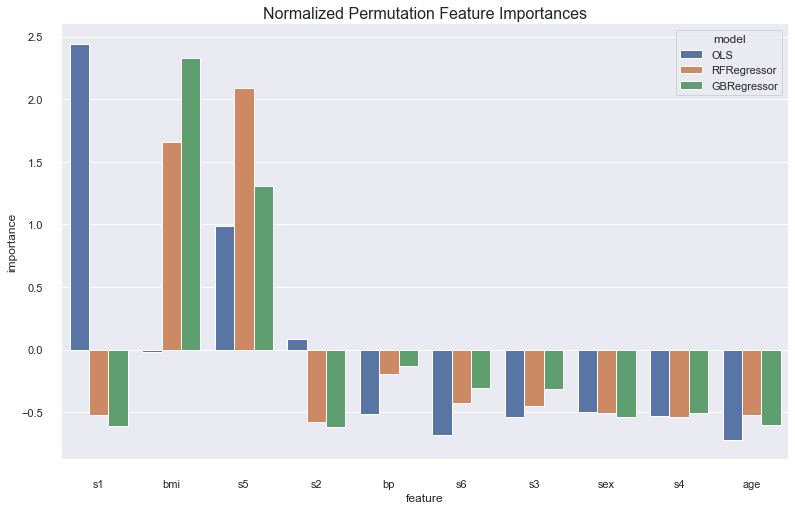
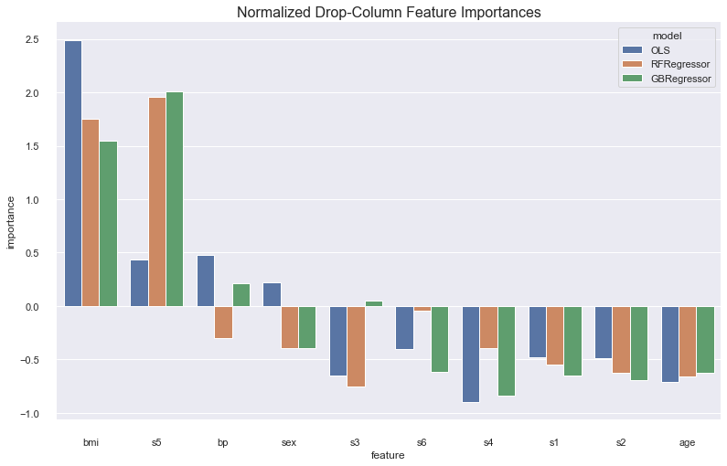
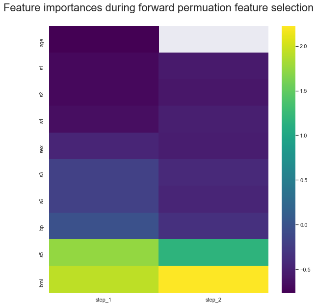
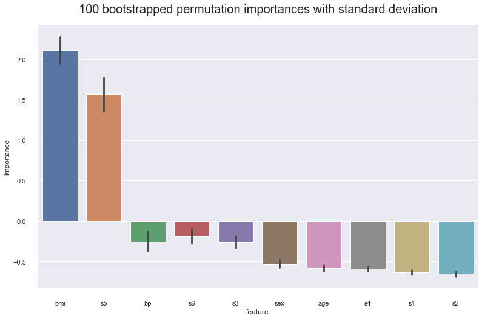

# Feature Importance 
Feature importance encompasses a suite of techniques to assess individual impact of a feature on a model. A score is usually calculated for all the features in order to rank them. Feature importance is important for the three reasons outlined [here](https://towardsdatascience.com/understanding-feature-importance-and-how-to-implement-it-in-python-ff0287b20285). 

1. It allows you to understand your data and model better by quantifiying the relationship between features and the model
2. It allows you to remove unimportant features to make the model simpler and train faster

In this report, we implement data-based feature importances such as Spearman's rank correlation, and Principal Components Analysis, which calculate a score using only the data. We also implement model-based feature importances such as drop-column and permutation feature importance, and we analyze these techniques and their practical effects on model selection.

We use the toy diabetes dataset for all our analysis.

    .. _diabetes_dataset:
    
    Diabetes dataset
    ----------------
    
    Ten baseline variables, age, sex, body mass index, average blood
    pressure, and six blood serum measurements were obtained for each of n =
    442 diabetes patients, as well as the response of interest, a
    quantitative measure of disease progression one year after baseline.
    
    **Data Set Characteristics:**
    
      :Number of Instances: 442
    
      :Number of Attributes: First 10 columns are numeric predictive values
    
      :Target: Column 11 is a quantitative measure of disease progression one year after baseline
    
      :Attribute Information:
          - age     age in years
          - sex
          - bmi     body mass index
          - bp      average blood pressure
          - s1      tc, T-Cells (a type of white blood cells)
          - s2      ldl, low-density lipoproteins
          - s3      hdl, high-density lipoproteins
          - s4      tch, thyroid stimulating hormone
          - s5      ltg, lamotrigine
          - s6      glu, blood sugar level
    
    Note: Each of these 10 feature variables have been mean centered and scaled by the standard deviation times `n_samples` (i.e. the sum of squares of each column totals 1).
    
    Source URL:
    https://www4.stat.ncsu.edu/~boos/var.select/diabetes.html
    
    For more information see:
    Bradley Efron, Trevor Hastie, Iain Johnstone and Robert Tibshirani (2004) "Least Angle Regression," Annals of Statistics (with discussion), 407-499.
    (https://web.stanford.edu/~hastie/Papers/LARS/LeastAngle_2002.pdf)

# Data-based importance strategies

## Spearman's Rank Correlation

Spearman's rank correlation is a non-parametric measure of the correlation between two variables. We rank each of the features and responses, and calculate the correlation of the ranks. The effect of ranking the variables and calculating the correlation using the respective ranks is that it assesses how well a monotonically increasing function explains the data.

    <AxesSubplot:title={'center':"Spearman's rank correlation"}, xlabel='feature', ylabel='importance'>

    

    

## PCA
Principal components analysis is a dimensionality reduction algorithm. We reconstruct the data into `n` principal components, which are just linear combinations of the original data that capture the maximum amount of variability and are uncorrelated. Here we set the number of components to be the number of features so we can use the proportion of variability explained by a principal component as our quantitative measure of feature importance.

    

    

It is interesting to see that while `age` is the most important feature using PCA, it is not important according to spearman correlation.

# Model-based importance strategies

We test feature importances using three models: an Ordinary Least Squares model, a Random Forest Regressor model, and a Gradient Boosted Regression model. Firstly, we perform a randomized grid search to find our best baseline models using 5-fold cross-validated $R^{2}$ score.

    OLS parameter space: {}
    RFRegressor parameter space: {'max_depth': [1, 2, 3, 4, 5, 6, 7, 8, 9, None], 'min_samples_leaf': [1, 3, 5, 7, 9]}
    GBRegressor parameter space: {'max_depth': [1, 2, 3, 4, 5, 6, 7, 8, 9, None], 'min_samples_leaf': [1, 3, 5, 7, 9], 'learning_rate': [0.0001, 0.001, 0.01, 0.1]}

Searching for the best model

    OLS best params: {}
    RFRegressor best params: {'min_samples_leaf': 7, 'max_depth': 3}
    GBRegressor best params: {'min_samples_leaf': 7, 'max_depth': 1, 'learning_rate': 0.1}

## Permutation Importance
The permuation importance algorithm works like this: First calculate a baseline score using a metric of choice. Then for every feature, shuffle that feature to break the relationship between it and the response variable, and recalculate your metric. Keep track of the differences between the baseline metric and the metric calculated without that feature. The bigger the difference is, the more important the feature is because it causes a larger decrease in performace of the model.

    <AxesSubplot:title={'center':'Normalized Permutation Feature Importances'}, xlabel='feature', ylabel='importance'>

    

    

## Drop-Column Importance

Drop column feature importance is similar to permutation importance. The key difference is that instead of shuffling the feature you want to calculate an importance for, you drop it entirely. Therefore your feature importance is a measure of the decrease in model performance when that feature is excluded.

    <AxesSubplot:title={'center':'Normalized Drop-Column Feature Importances'}, xlabel='feature', ylabel='importance'>

    

    

# Comparing Strategies

We compare the $R^{2}$ of a Gradient-Boosted Regression model on the diabetes dataset when training on the top `k` features selected by the respective techniques. Permutation importance and Spearman correlation seem to give the best results, with drop-column a bit behind, and PCA only converging as `k = num_features`.

    

    

# Automatic Feature Selection

In my feature selection algorithm, we use permutation importance to calculate the feature importance of each column. We start by calculating the feature importances considering the full dataset. We calculate a baseline $R^{2}$ score on the validation set. Then, we drop the lowest feature importance column, refit the model to the data without this feature, and recalculate the $R^{2}$ score. We stop as soon as our metric gets worse.

We plot a heatmap of the feature importances recalculated at each step, with the lowest permuation feature importance being dropped until the stopping condition is reached of a lower cross-validated $R^{2}$ score as compared to baseline is reached. It is importance to recalculate feature importances because of codependencies between features e.g. `s3` and `age`. Although at baseline `s3` is fifth most importance feature, after droppin `age` it is the least important.

    

    

# Variance and empirical p-values for feature importances

## Variance
We get 100 bootstrap samples of the data with replacement, with a bootstrap size of 75% of the training set. The results show the feature importances for `s5`, `bp`, and `s3` are in the range of its standard deviation. We want to confirm our hypothesis these feature importances are not important by calculating the empirical p-values.

    

    

## Empirical p-values

Our hypotheses are confirmed. By comparing how often a feature importance drawn from the null distribution is less than the baseline feature importance calculated from the original data, we find that none of the feature importances `s5`, `bp`, or `s3` are significant at the $\alpha = 0.04$ significance level.

    Empircal p-value for s5: 0.78
    Empircal p-value for bp: 0.64
    Empircal p-value for s3: 0.11

    

    

