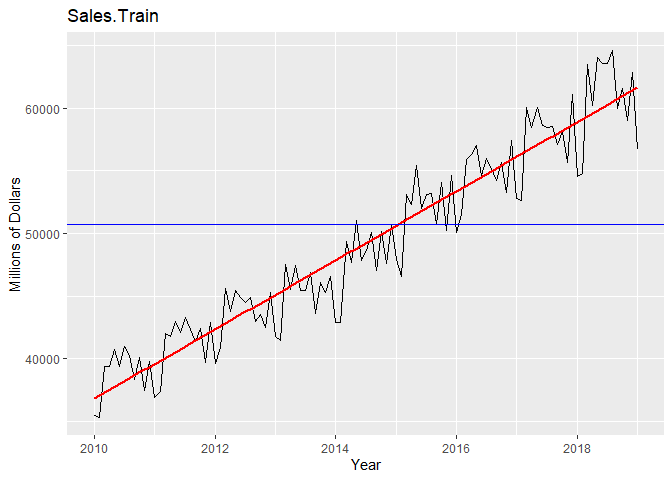
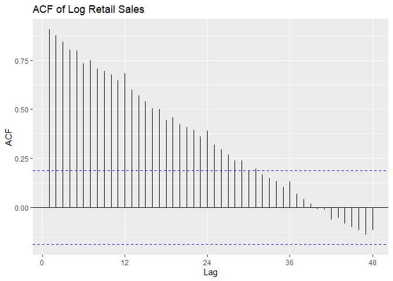
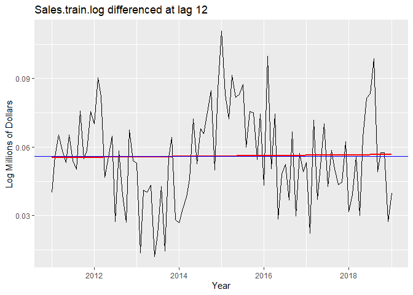
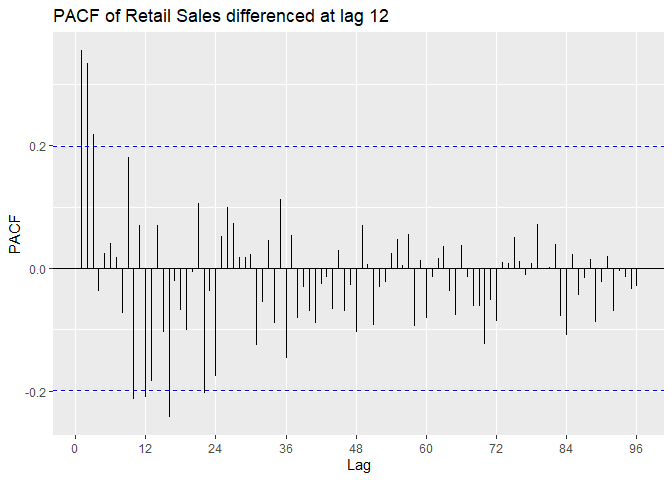
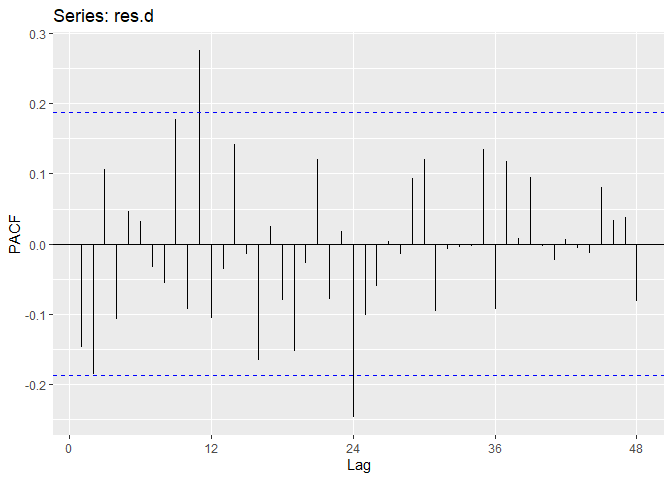
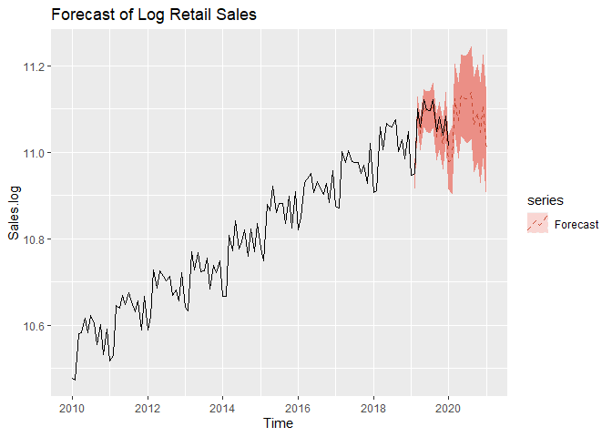

# Retail Sales Forecasting
---
I. Abstract
===========

In this report I will attempt extract information on economic activity
in the restaurant industry throughout the year. I will do this by
applying time series techniques on retail sales (in millions of dollars)
of food services and drinking places. Using a Box-Jenkins methodology, I
build a model and forecast with it. I find that economic activity in the
restaurant industry is highest in summer months and lowest in the two
months after Christmas. I conclude from my forecasts that the demand for
food services and drinking places is steadily growing.

II. Introduction
================

Retail sales are one of the primary measures of consumer demand for both
durable and non-durable goods. Retail sales is an important economic
indicator that widely used in government, academic, and business
communities to measure economic health. This dataset provides the retail
sales of food services and drinking places in millions of dollars each
month.

In this report, I will model and forecast retail sales to gain insight
into the state of the food-service industry. I will use differencing and
Box-Cox transformations to make the data stationary. Then, I will
identify candidate models from the ACF/PACF of the transformed and
differenced time series. I will estimate the parameters of the candidate
models and select the model using AICc and performing diagnostic
checking to ensure the model is a good fit. Lastly, I will forecast on
the transfromed and original data using the final model.

I was able to find that retail sales is growing steadily over time.
However, my forecasts were not able to account for the near 30% drop in
retail sales from Covid-19 in the past few months.

My data was downloaded from
<https://fred.stlouisfed.org/series/RSFSDPN>. My report was made through
the ggplot2, ggfortify, forecast, MASS, and qpcR packages.

III. Model Building and Forecasting
===================================

Model Identification
--------------------

We can see from plotting the original data that the data is
non-stationary: there is a linear trend and a seasonal component. The
ACF confirms this as it remains large and periodic even at large lags.
We suspect the period s = 12 because we see small spikes in the ACF at
multiples of 12. We can also see that the variance seems to be
increasing with time and the histogram of the data is skewed.

I try a Box-Cox transformation to stabilize the variance/seasonal effect
and to make the data more normally distributed. Because *λ* = 0 is
within the 95% Confidence interval of the Box-Cox transformation, we use
a log-transformation on the original data. We can see that the variance
is no longer increasing with time and the data is more normally
distributed.

We plot the time series, a histogram, and the P/ACF of the
log-transformed data here.

To eliminate seasonality, we try differencing the log-transformed data
at lag 12. The variance decreases, so the data is not overdifferenced.
From the plot we can see that there is now no trend. When we difference
again at lag 1 to remove a potential linear trend, the variance
increases, so the differencing is unnecessary and our data is
stationary.

We look at the P/ACF of Sales.train.log differenced at lag 12 to
identify the model. ACF appears to be oscillating. From Lecture 13 we
can suspect an AR model.  
PACF is outside confidence intervals at lags 1,2, maybe 3, maybe 10,
maybe 12, maybe 16. PACF appears to cut off at lag 2 or lag 3, with a
small spike at lag 12. We suspect p = 2 or p = 3, with P = 0 or P = 1.

SARIMA(3, 0, 0) × (0, 1, 0)12
SARIMA(2, 0, 0) × (0, 1, 0)12
SARIMA(3, 0, 0) × (1, 1, 0)12
SARIMA(2, 0, 0) × (1, 1, 0)12

    ## [1] "Variance of Sales.train.log"

    ## [1] 0.02388367

    ## [1] "Variance of Sales.train.log differenced at lag 12"

    ## [1] 0.0004169038

    ## [1] "Variance of Sales.train.log differenced at lag 1 and lag 12"

    ## [1] 0.0005385189

Model Estimation
----------------

We estimate the parameters of the models using MLE. We see that that the
SAR component in model B and model C is not significant because it is
within the 95% confidence interval; standard deviation is bigger than
estimate of the coefficient. This leaves us with model A and model D.

    ## [1] "Model A"

    ## 
    ## Call:
    ## arima(x = Sales.train.log, order = c(3, 0, 0), seasonal = list(order = c(0, 
    ##     1, 0), period = 12), method = "ML")
    ## 
    ## Coefficients:
    ##          ar1     ar2     ar3
    ##       0.2572  0.4012  0.3129
    ## s.e.  0.0962  0.0909  0.0970
    ## 
    ## sigma^2 estimated as 0.0003266:  log likelihood = 250.29,  aic = -492.59

    ## [1] "Model B"

    ## 
    ## Call:
    ## arima(x = Sales.train.log, order = c(2, 0, 0), seasonal = list(order = c(1, 
    ##     1, 0), period = 0), method = "ML")
    ## 
    ## Coefficients:
    ##          ar1     ar2     sar1
    ##       0.4289  0.5349  -0.0586
    ## s.e.  0.0847  0.0850   0.1090
    ## 
    ## sigma^2 estimated as 0.0003611:  log likelihood = 245.53,  aic = -483.06

    ## [1] "Model C"

    ## 
    ## Call:
    ## arima(x = Sales.train.log, order = c(3, 0, 0), seasonal = list(order = c(1, 
    ##     1, 0), period = 12), method = "ML")
    ## 
    ## Coefficients:
    ##          ar1     ar2     ar3     sar1
    ##       0.2540  0.3983  0.3243  -0.1032
    ## s.e.  0.0961  0.0906  0.0974   0.1094
    ## 
    ## sigma^2 estimated as 0.0003231:  log likelihood = 250.73,  aic = -491.47

    ## [1] "Model D"

    ## 
    ## Call:
    ## arima(x = Sales.train.log, order = c(2, 0, 0), seasonal = list(order = c(0, 
    ##     1, 0), period = 12), method = "ML")
    ## 
    ## Coefficients:
    ##          ar1     ar2
    ##       0.4263  0.5336
    ## s.e.  0.0846  0.0850
    ## 
    ## sigma^2 estimated as 0.0003623:  log likelihood = 245.39,  aic = -484.78

Before we move onto diagnostic checking, we want to make sure that our
models are causal and stationary. Because model A and model D are both
pure AR(p) models, they are always invertible. We show that both models
are both causal and stationary because all of their roots lie inside of
the unit circle.

Diagnostic Checking
-------------------

Now we will perform diagnostic checking on model A to determine whether
our model is a good fit by analyzing the residuals. If our model is a
good fit, the residuals should exhibit behavior similar to a White Noise
process. Our plot of the residuals shows that the mean is about zero
,there is little to no trend, no seasonality, and no change in variance.
The residuals are roughly normally distributed, and the quantile -
quantile plot forms a straight line. The residuals also pass the
Shapiro-Wilk normality test. The sample P/ACF of the residuals can be
counted as 0 after applying Bartlett’s formula, as well as the ACF of
the residuals squared. The residuals pass the Box-Pierce test and
Ljung-Box test, so we accept our WN hypothesis at level 0.05. The
squared residuals pass the Mcleod-li test so there is not nonlinear
dependence. After applying Yule-Walker estimation and AICC statistics to
the residuals, they come out as an AR(0) process so they are compatible
with WN.

    ## 
    ##  Shapiro-Wilk normality test
    ## 
    ## data:  res.a
    ## W = 0.98174, p-value = 0.1409

    ## 
    ##  Box-Pierce test
    ## 
    ## data:  res.a
    ## X-squared = 10.395, df = 8, p-value = 0.2384

    ## 
    ##  Box-Ljung test
    ## 
    ## data:  res.a
    ## X-squared = 11.583, df = 8, p-value = 0.1708

    ## 
    ##  Box-Ljung test
    ## 
    ## data:  res.a.sq
    ## X-squared = 5.8357, df = 11, p-value = 0.8841

    ## 
    ## Call:
    ## ar(x = res.a, aic = TRUE, order.max = NULL, method = c("yule-walker"))
    ## 
    ## 
    ## Order selected 0  sigma^2 estimated as  0.0002988

    ## [1] "AICC of Model A"

    ## [1] -492.3585

Now we perform diagnostic tests on model D. Our plot of the residuals
shows that the mean is about zero ,there is little to no trend, no
seasonality, and no change in variance. The residuals less normally
distributed than model A, but the quantile - quantile plot still forms a
straight line. The residuals pass the Shapiro-Wilk normality test. We
see a few significant spikes in the P/ACF of the residuals, as well as
the ACF of the residuals squared. The residuals fail the Box-Pierce test
and Ljung-Box test, so we reject our WN hypothesis at level 0.05. The
squared residuals pass the Mcleod-li test. After applying Yule-Walker
estimation and AICC statistics to the residuals, they come out as an
AR(2) process, showing that there is some information that is not being
captured by our model. Based off the diagnostic checking, we reject
model D as a good fit for the data.

    ## 
    ##  Shapiro-Wilk normality test
    ## 
    ## data:  res.d
    ## W = 0.98171, p-value = 0.1401

    ## 
    ##  Box-Pierce test
    ## 
    ## data:  res.d
    ## X-squared = 22.262, df = 9, p-value = 0.008085

    ## 
    ##  Box-Ljung test
    ## 
    ## data:  res.d
    ## X-squared = 24.164, df = 9, p-value = 0.00405

    ## 
    ##  Box-Ljung test
    ## 
    ## data:  res.d.sq
    ## X-squared = 9.2166, df = 11, p-value = 0.6019

    ## 
    ## Call:
    ## ar(x = res.d, aic = TRUE, order.max = NULL, method = c("yule-walker"))
    ## 
    ## Coefficients:
    ##       1        2  
    ## -0.1758  -0.1864  
    ## 
    ## Order selected 2  sigma^2 estimated as  0.000315

    ## [1] "AICC of Model D"

    ## [1] -484.6649

We choose model A because of the more desirable properties of its
residuals and its lower AICc. Our final model is
(1 − *B*12)(1 − 0.257*B* − 0.401*B*2 − 0.313*B*3)*X**t* = *Z**t*
  
where *Z**t* ∼ *N*(0, 0.00032).

We now move on to forecasting. We assume an adequate time series model
was obtained and MLE estimates of coefficents are obtained from the
previous steps. We can forecast on the log-transformed data first. We
can see that test set falls with our 95% Prediction intervals.

Forecasting
-----------

Now we forecast on the original data by exponentiating the forecasted
values prior. The test set still falls within our 95% Prediction
intervals.

IV. Conclusion
==============

In conclusion, I was able to successfully model the data as a *A**R*(3)
process, differenced at lag 12 or as a
*S**A**R**I**M**A*(3, 0, 0) × (0, 1, 0)12. The final model
was
(1 − *B*12)(1 − 0.257*B* − 0.401*B*2 − 0.313*B*3)*X**t* = *Z**t*
  
where *Z**t* ∼ *N*(0, 0.00032)

From our results we found that we could forecast retail sales in food
services and drinking places that were close to the true values. We
found that retail sales are generally the lowest in January, with the
summer months of May to August being the busiest for this industry.
There are spikes in activity in March, October, and December, coinciding
with Spring break, Halloween, and Christmas. Our forecasts show a slow,
steady growth in this industry over the next two years representing a
safe investment opportunity. However, Covid-19 may cause permanent
shifts in this industry, and the long-term effects of the pandemic are
not captured in this study.

V. References
=============

U.S. Census Bureau, Retail Sales \[RSFSDPN\], retrieved from FRED,
Federal Reserve Bank of St. Louis;
<a href="https://fred.stlouisfed.org/series/RSFSDPN" class="uri">https://fred.stlouisfed.org/series/RSFSDPN</a>,
June 11, 2020.

VI. Appendix
============

    # Convert data into time series object
    Sales <- ts(Sales.csv[,2], start = c(2010,1),frequency=12)

    # Split into Training/Test sets, leave 12 observations for forecasting
    Sales.train <- ts(Sales[c(1:109)],start = c(2010,1),frequency=12)
    Sales.test <- ts(Sales[c(110:length(Sales))],start = c(2019,2),frequency=12)

    # Plot Training data with mean and trend
    autoplot(Sales.train) +
      geom_smooth(method = "lm", se = FALSE, color = 'red') +             
      labs(x = "Year", y = "Millions of Dollars") +
      ggtitle("Sales.Train") +
      geom_hline(yintercept = mean(Sales), color="blue")

    # Plot histogram of training data
    gghistogram(Sales.train, add.normal=TRUE) # Data looks normally distributed

    # Plot ACF
    ggAcf(Sales.train, lag = 48) +
      ggtitle('ACF of Retail Sales')

    # Plot PACF
    ggPacf(Sales.train, lag = 48) +
      ggtitle('PACF of Retail Sales')

    ## Boxcox transformation
    bcTransform <- boxcox(Sales.train~as.numeric(1:length(Sales.train))) 
    lambda = bcTransform$x[which(bcTransform$y == max(bcTransform$y))]
    # lambda

    # Since 0 is in confidence interval log transform data
    Sales.train.log <- log(Sales.train)
    Sales.log <- log(Sales)

    # Plot log transformed Training data
    autoplot(Sales.train.log) +
      labs(x = "Year", y = "Log Millions of Dollars") +
      ggtitle("Log Sales.train")

    gghistogram(Sales.train.log, add.normal = TRUE) # Data looks normally distributed

    # Plot ACF
    ggAcf(Sales.train.log, lag = 48) +
      ggtitle('ACF of Log Retail Sales')

    # Plot PACF
    ggPacf(Sales.train.log, lag = 48) +
      ggtitle('PACF of Log Retail Sales')

    ## Differencing Sales.train.log at lag 12 to remove seasonality
    print('Variance of Sales.train.log')
    var(Sales.train.log)
    Sales.train.log_12 <- diff(Sales.train.log, lag=12)
    print('Variance of Sales.train.log differenced at lag 12')
    var(Sales.train.log_12) # Variance is lower 
    # var(Sales.train.log) > var(Sales.train.log_12)

    # Plot
    autoplot(Sales.train.log_12)+
      geom_smooth(method = "lm", se = FALSE, color = 'red') +
      geom_hline(yintercept = mean(Sales.train.log_12), color="blue") +
      labs(x = "Year", y = "Log Millions of Dollars") +
      ggtitle("Sales.train.log differenced at lag 12") 
    # Data looks stationary after eliminating seasonality

    gghistogram(Sales.train.log_12, add.normal=TRUE) # Data looks normally distributed

    # Plot ACF 
    ggAcf(Sales.train.log_12, lag = 100) +
      ggtitle('ACF of Log Retail Sales differenced at lag 12')

    # Plot PACF
    ggPacf(Sales.train.log_12, lag = 100) +
      ggtitle('PACF of Log Retail Sales differenced at lag 12')
      
    # Differencing Sales.train.log again at lag 12 and lag 1 to remove trend

    Sales.train.log_1_12 <- diff(Sales.train.log_12, lag=1)
    print("Variance of Sales.train.log differenced at lag 1 and lag 12")
    var(Sales.train.log_1_12) 

    # var(Sales.train.log_12) > var(Sales.train.log_1_12) # Variance is higher, overdifferenced: Do not difference at lag 1

    ## Model Estimation
    print("Model A")
    # Estimate parameters of SARIMA model
    a = arima(Sales.train.log, order=c(3,0,0), seasonal = list(order = c(0,1,0), period = 12),method="ML")
    a

    print("Model B")
    # Estimate parameters of SARIMA model
    b = arima(Sales.train.log, order=c(2,0,0), seasonal = list(order = c(1,1,0), period = 0), method="ML")
    b

    print("Model C")
    # Estimate parameters of SARIMA model
    c = arima(Sales.train.log, order=c(3,0,0), seasonal = list(order = c(1,1,0), period = 12), method="ML")
    c

    print("Model D")
    # Estimate parameters of SARIMA model
    d = arima(Sales.train.log, order=c(2,0,0), seasonal = list(order = c(0,1,0), period = 12), method="ML")
    d

    # Plot inverse roots of AR part: They should all be inside unit circle
    plot(a, main = 'Inverse AR roots of model A')

    # Plot inverse roots of AR part: They should all be inside unit circle
    plot(b, main = 'Inverse AR roots of model A')

    ## Diagnostic Checking, model A
    # Get residuals of model a
    res.a <- residuals(a)

    # Plot residuals
    autoplot(res.a) +
      geom_smooth(method = "lm", se = FALSE, color = 'red') +   
      labs(x = "Time") +
      ggtitle("res.a plot") +
      geom_hline(yintercept = mean(res.a), color="blue")
    # mean(res.a) # Sample mean is about 0

    # Plot histogram of residuals
    gghistogram(res.a,add.normal = TRUE)

    # Plot ACF/PACF
    ggAcf(res.a,lag.max = 48);ggPacf(res.a,lag.max=48)

    # Normal Q-Q Plot
    qqnorm(res.a) 
    qqline(res.a,col='blue')

    # square residuals for Mcleod-Li test
    res.a.sq <- res.a^2
    ggAcf(res.a.sq, lag.max = 48)

    # Test residuals for normality
    shapiro.test(res.a)

    # Square-root of 121 = 11. p = 3, q = 0 so fitdf = p +q = 3
    Box.test(res.a, lag=11, type = c('Box-Pierce'),fitdf =3) 
    Box.test(res.a, lag=11, type = c('Ljung-Box'),fitdf =3)

    # Mcleod-li test
    Box.test(res.a.sq, lag=11, type = c('Ljung-Box'),fitdf =0)

    # Check if residuals fit to WN Process
    ar(res.a, aic = TRUE, order.max = NULL, method = c("yule-walker"))

    print('AICC of Model A')
    AICc(a)

    ## Diagnostic Checking, model D
    # Get residuals of model c
    res.d <- residuals(d)

    # Plot residuals
    autoplot(res.d) +
      geom_smooth(method = "lm", se = FALSE, color = 'red') +   
      labs(x = "Time") +
      ggtitle("res.d plot") +
      geom_hline(yintercept = mean(res.d), color="blue")
    # mean(res.d) # Sample mean is about 0

    # Plot histogram of residuals
    gghistogram(res.d, add.normal = TRUE) 

    # Plot ACF/PACF
    ggAcf(res.d,lag.max = 48);ggPacf(res.d,lag.max=48)

    # Normal Q-Q Plot
    qqnorm(res.d) 
    qqline(res.d,col='blue')

    # square residuals for Mcleod-Li test
    res.d.sq <- res.d^2
    ggAcf(res.d.sq, lag.max = 48)

    # Test residuals for normality
    shapiro.test(res.d)

    # Square-root of 121 = 11. p = 2, q = 0 so fitdf = p +q = 3
    Box.test(res.d, lag=11, type = c('Box-Pierce'),fitdf =2)
    Box.test(res.d, lag=11, type = c('Ljung-Box'),fitdf =2)

    # Mcleod-li test
    Box.test(res.d.sq, lag=11, type = c('Ljung-Box'),fitdf =0)

    # Check if residuals fit to WN Process
    ar(res.d, aic = TRUE, order.max = NULL, method = c("yule-walker"))

    print('AICC of Model D')
    AICc(d)

    ## Forecast on log-transformed data using Model A
    autoplot(Sales.log, series = 'data',color='black') +
      autolayer(forecast(a,level=c(95)), series = 'Forecast',linetype='dashed') +
      autolayer(log(Sales.test), series='True values',color='black')+
      ggtitle('Forecast of Log Retail Sales')

    # Zoom in
    autoplot(window(Sales.log,start=2018), series = 'data',color='black') +
      autolayer(forecast(a,level=c(95)), series = 'Forecast', linetype='dashed') +
      autolayer(log(Sales.test), series='True values',color='black') +
      ggtitle('Forecast of Log Retail Sales') +
      geom_point()

    # Fit model to and forecast original data
    pred.orig <- forecast(arima(Sales.train, order=c(3,0,0), seasonal = list(order = c(1,1,0), period = 12),method="ML"),level=c(95))

    ## Forecast on original data using Model A
    autoplot(Sales, series = 'data',color='black') +
      autolayer(pred.orig, series = 'Forecast', linetype='dashed') +
      autolayer(Sales.test, series='True values',color='black')+
      ggtitle('Forecast of Retail Sales')

    # Zoom in
    autoplot(window(Sales,start=2018), series = 'data',color='black') +
      autolayer(pred.orig,series = 'Forecast',  linetype='dashed') +
      ggtitle('Forecast of Retail Sales ') +
      autolayer(Sales.test, series='True values',color='black') + 
      geom_point() +
      ggtitle('Forecast of Retail Sales')
