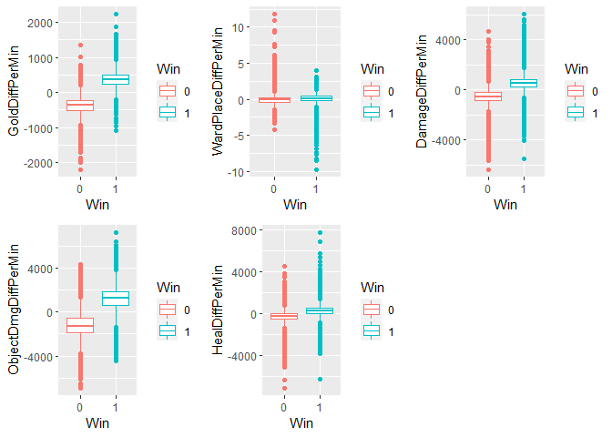

# League of Legends Win Classifier
---

League of Legends, commonly abbreviated LoL, is a popular video game
with millions of concurrent players. In its premier 5v5 competitive
mode, the objective is to destroy the opposing team’s nexus. In this
report, we will attempt to classify whether a given team wins or loses
using measures of in-game performance.

A Brief Primer on LoL
---------------------

In a LoL game, each player selects a unique champion to control for the
duration of the game, which is usually from 20-40 minutes. The goal is
to destroy the opposing team’s nexus, which are located on in the enemy
base protected by layers of towers which damage enemies that walk within
a certain radius. Minions spawn from each nexus and walk down one of the
three lanes on the game map and attack enemy minions, champions, and
towers.  

Each player that occupies a lane (or jungle where neutral minions spawn)
will kill enemy minions and enemy champions that give gold that can be
used to buy items in their base that strengthen their champion. There
are also two neutral objectives along the centerline of the map that
grant teamwide buffs that make killing enemy minions, champions, and
towers easier. There are three towers in each lane that must be
destroyed in order from outermost to innermost. After the third and
innermost tower of a lane is destroyed, the inhibitor is targetable in
that lane. The destruction of the inhibitor causes the minions in that
lane to become empowered and destroy enemy minions and towers with ease.
The two nexus turrets also become targetable. When the nexus turrets go
down, then the enemy nexus is vulnerable and the team that destroys the
nexus wins. \#\# Research Question I am interested in investigating how
beneficial variables such as enemy champion kills, vision, and
experience are for League of Legends teams. My research question is
this: How accurately can we classify a team as a winner or loser looking
at the overall performance of the team?

I. Data
========

I obtained my data from kaggle. The data is from ranked League of
Legends games from the three highest LoL ranks: Challenger, GrandMaster,
and Master. These top three divisions comprise of the top 0.1% League
players in the world (Christina Gough [2019](#ref-Percentage)).

The data comes in the form of three csv files. There is one csv file for
each division: Challenger, Grandmaster, and Master. I have combined each
of the csv files into the dataframe HighElo. Included in HighElo are 48
predictors with 24 being unique to each team, and then the variable
gameDuraton which is equal for both teams. We exclude the column gameId
as it has no bearing on the outcome of the game.We cam see that there
are a total of 49 predictor variables, with 47 being integers and 2
being numeric.

<table>
<caption>Dimensions of HighElo</caption>
<thead>
<tr class="header">
<th style="text-align: right;">Rows</th>
<th style="text-align: right;">Columns</th>
</tr>
</thead>
<tbody>
<tr class="odd">
<td style="text-align: right;">185568</td>
<td style="text-align: right;">50</td>
</tr>
</tbody>
</table>

<table>
<caption>Predictor variables: Count and type, High Elo</caption>
<thead>
<tr class="header">
<th style="text-align: left;">Type</th>
<th style="text-align: right;">Frequency</th>
</tr>
</thead>
<tbody>
<tr class="odd">
<td style="text-align: left;">integer</td>
<td style="text-align: right;">47</td>
</tr>
<tr class="even">
<td style="text-align: left;">numeric</td>
<td style="text-align: right;">3</td>
</tr>
</tbody>
</table>

<table>
<caption>Missingness of HighElo</caption>
<thead>
<tr class="header">
<th style="text-align: right;">Missing Observations</th>
</tr>
</thead>
<tbody>
<tr class="odd">
<td style="text-align: right;">0</td>
</tr>
</tbody>
</table>

Because the original data does not account for game length for each
metric, we will be creating new features that do that and visualize them
in the Methods section. I have already added a column to convert the
game duration to minutes which we will use to calculate metrics based on
the difference in gold, champion damage, objective damage, and more per
minute to equate for game length. We have also discarded all games less
than 15 minutes as that is the earliest possible time a team can
surrender. \# III. Methods

Analysis Plan
-------------

My analysis plan is to use supervised machine learning to classify a
given LoL team to the labels “Win” or “Lose”. Because this is a binary
classification problem, I believe it would be appropriate to train a
logistic regression model and a Random Forest models on the data. For
the Logistic Regression Model, I will find the optimal threshold value
for classification by calculating the smallest euclidean distance
between (*F**P**R*, *F**N**R*) and (0, 0). For the Random Forest model,
I will tune the parameter mtry using the function tuneRF(). My final
model will be the lower of the validation error of 10-Fold Cross
Validation on the Logistic Regression, or the Out-of-Bag error rate for
the Random Forest (Cross-validation is not necessary since the
Out-of-Bag error rate approximates the validation error).

I will randomly choose between whether I am classifying the binary
win/loss outcome variable for blue side or red side. My response
variable will be the binary outcome variable Win, which equals 1 if the
selected team wins and 0 if they lose.

I made a 80/20 split for the Training and Test Sets, which leaves us
with 148,454 observations in the training set and 37,114 observations in
the test set.I designated a 50/50 split of the Training and Test sets
analyzing the game from the blue side and red side. I then created new
features GoldDiffPerMin, WardPlaceDiffPerMin,HealDiffPerMin, and other
binary variables that only tracked the condition of the variable for the
team chosen. I concatenated Blue and Red dataframes together to get my
new Training and Test datasets.

    #Training and Test splits
    set.seed(1)
    SampleIndex <- sample(1:nrow(HighElo),0.80*nrow(HighElo))
    Train <- HighElo[SampleIndex,]
    Test <- HighElo[-SampleIndex,]

    # Sample 50% of games from blue side for training and test set
    set.seed(2)
    SampleBlueTrain <- sample(1:nrow(Train),0.5*nrow(Train))
    SampleBlueTest <- sample(1:nrow(Test),0.5*nrow(Test))

    #Create Blue training set and Red training set
    BlueTrain <- Train[SampleBlueTrain,]
    RedTrain <- Train[-SampleBlueTrain,]

    # Combine Blue and Red Test sets back into one set using new predictors
    Test <- rbind(BlueTest,RedTest)

    # Create Train response and Train predictors
    Test <- select(Test,MinGameDuration:Win)
    Test$Win <- as.factor(Test$Win)

    TestY <- select(Test, Win)
    TestX <- select(Test, -Win)

Data Overview of new features
-----------------------------

The basic attributes of the modified set of all the data are summarized
below, along with the five-number summary of the continuous variables. I
have summarized the counts of the binary variables as well. The average
game time is 24.89 minutes. We can see that most of the predictors have
long tails in their distributions.

    ## $MinGameDuration
    ##    Min. 1st Qu.  Median    Mean 3rd Qu.    Max. 
    ##   15.00   20.08   24.37   24.89   29.27   62.63 
    ## 
    ## $GoldDiffPerMin
    ##       Min.    1st Qu.     Median       Mean    3rd Qu.       Max. 
    ## -2196.7251  -357.7404    -0.5794    -0.2470   357.7043  2231.9337 
    ## 
    ## $WardPlaceDiffPerMin
    ##      Min.   1st Qu.    Median      Mean   3rd Qu.      Max. 
    ## -9.728097 -0.326594  0.000000  0.001493  0.327154 11.766883 
    ## 
    ## $DamageDiffPerMin
    ##      Min.   1st Qu.    Median      Mean   3rd Qu.      Max. 
    ## -6348.849  -559.068     1.429     0.784   562.967  6024.704 
    ## 
    ## $HealDiffPerMin
    ##      Min.   1st Qu.    Median      Mean   3rd Qu.      Max. 
    ## -7057.366  -344.173    -2.328    -0.520   342.610  7670.970 
    ## 
    ## $ObjectDmgDiffPerMin
    ##      Min.   1st Qu.    Median      Mean   3rd Qu.      Max. 
    ## -6899.430 -1293.020     1.104    -1.088  1288.071  7206.353

Here is a data overview of the new features created from the original
data.

<table>
<caption>Dimensions of All Data</caption>
<thead>
<tr class="header">
<th style="text-align: right;">Rows</th>
<th style="text-align: right;">Columns</th>
</tr>
</thead>
<tbody>
<tr class="odd">
<td style="text-align: right;">185568</td>
<td style="text-align: right;">11</td>
</tr>
</tbody>
</table>

<table>
<caption>Predictor variables: Count and type, All Data</caption>
<thead>
<tr class="header">
<th style="text-align: left;">Type</th>
<th style="text-align: right;">Frequency</th>
</tr>
</thead>
<tbody>
<tr class="odd">
<td style="text-align: left;">factor</td>
<td style="text-align: right;">1</td>
</tr>
<tr class="even">
<td style="text-align: left;">integer</td>
<td style="text-align: right;">4</td>
</tr>
<tr class="odd">
<td style="text-align: left;">numeric</td>
<td style="text-align: right;">6</td>
</tr>
</tbody>
</table>

<table>
<caption>Missingness of All Data</caption>
<thead>
<tr class="header">
<th style="text-align: right;">Missing Observations</th>
</tr>
</thead>
<tbody>
<tr class="odd">
<td style="text-align: right;">0</td>
</tr>
</tbody>
</table>

<table>
<caption>Frequencies for binary variables</caption>
<thead>
<tr class="header">
<th style="text-align: left;"></th>
<th style="text-align: right;">FirstTower</th>
<th style="text-align: right;">FirstBaron</th>
<th style="text-align: right;">FirstInhibitor</th>
<th style="text-align: right;">FirstDragon</th>
<th style="text-align: right;">Win</th>
</tr>
</thead>
<tbody>
<tr class="odd">
<td style="text-align: left;">0</td>
<td style="text-align: right;">92340</td>
<td style="text-align: right;">135932</td>
<td style="text-align: right;">115699</td>
<td style="text-align: right;">99770</td>
<td style="text-align: right;">92837</td>
</tr>
<tr class="even">
<td style="text-align: left;">1</td>
<td style="text-align: right;">93228</td>
<td style="text-align: right;">49636</td>
<td style="text-align: right;">69869</td>
<td style="text-align: right;">85798</td>
<td style="text-align: right;">92731</td>
</tr>
</tbody>
</table>

I have created the boxplots of the response variable Win vs the
continuous predictors to get infer their relationships to the response.
From the boxplots it appears that GoldDiffPerMin and ObjectDmgDiffPerMin
are usually higher for winning teams.

II. Model Building
===================

Logistic Regression Model Building
----------------------------------

I fit a Logistic Regression Model using the glm() function, to model the
probability of Win on the predictors. The summary shows that all of the
coefficients are positive except FirstTower and FirstBaron. This can be
interpreted as meaning that the log-odds of winning are increased by all
of our predictors except FirstTower and FirstBaron, where the log-odds
of winning decrease when they are equal to 1. This goes against what we
see in our initial visualizations of the data, where I plotted the
response vs. the predictors, which showed that FirstTower and FirstBaron
was more often 1 for the winning teams. It is possible the the estimates
of the parameters of my Logistic Regression model are unstable, because
the classes are well-separated; in particular, GoldDiffPerMin is a very
good predictor of Win. After performing 10-Fold Cross Validation, my
validation error is 1.51%.

    ## 
    ## Call:
    ## glm(formula = Win ~ . - MinGameDuration, family = binomial, data = Train)
    ## 
    ## Deviance Residuals: 
    ##     Min       1Q   Median       3Q      Max  
    ## -7.4749  -0.0208   0.0000   0.0228   6.5889  
    ## 
    ## Coefficients:
    ##                       Estimate Std. Error z value Pr(>|z|)    
    ## (Intercept)          7.861e-02  4.000e-02   1.965   0.0494 *  
    ## GoldDiffPerMin       2.120e-02  2.329e-04  91.003  < 2e-16 ***
    ## WardPlaceDiffPerMin  1.715e-01  3.943e-02   4.350 1.36e-05 ***
    ## DamageDiffPerMin     2.524e-04  3.347e-05   7.542 4.62e-14 ***
    ## HealDiffPerMin       1.750e-04  3.620e-05   4.835 1.33e-06 ***
    ## ObjectDmgDiffPerMin  3.869e-04  3.081e-05  12.557  < 2e-16 ***
    ## FirstTower          -1.014e+00  4.305e-02 -23.558  < 2e-16 ***
    ## FirstBaron          -8.304e-01  4.560e-02 -18.210  < 2e-16 ***
    ## FirstInhibitor       1.317e+00  4.233e-02  31.118  < 2e-16 ***
    ## FirstDragon          2.268e-01  4.226e-02   5.368 7.95e-08 ***
    ## ---
    ## Signif. codes:  0 '***' 0.001 '**' 0.01 '*' 0.05 '.' 0.1 ' ' 1
    ## 
    ## (Dispersion parameter for binomial family taken to be 1)
    ## 
    ##     Null deviance: 205801  on 148453  degrees of freedom
    ## Residual deviance:  17318  on 148444  degrees of freedom
    ## AIC: 17338
    ## 
    ## Number of Fisher Scoring iterations: 9

    ## [1] "Cross Validation Error"

    ## [1] 0.01512488

Logistic Regression Model Analysis
----------------------------------

First I plotted the predictors versus the estimated probabilities of the
training data. It appears that past a positive threshold value of
GoldDiffPerMin, the estimated probability is always about 1. For the
other predictors, demonstrating that it is indeed a well-separated
class. WardPlaceDiffPerMin is similar except past a positive threeshold
value, the estimated probability of winning is 0.

In general, the estimated probability of winning is slightly higher for
the teams that capture the First Baron, First Tower, and First
Inhibitor.

I created an AUC graph and a ROC graph for the logistic regression on
Win. From the performance() function we can see that the optimal
threshold is 0.48, so we should set the threshold for predicting “Win”
when the probability is more than to 0.48. We can see from the ROC curve
that there is little tradeoff between tpr and fpr because the
classifcation error rate is so low. The Area under the Curve is 99.7%.
After setting the threshold value at 0.48, the test error rate for the
Logistic regression is 1.88% which shows that our model is generalizing
well to the test data, and not overfitting.

    ## [1] "Test Classification error for Logistic Regression"

    ## [1] 0.01880692

Random Forests Model Building
-----------------------------

Using the randomForest() function, I fit a Random Forest model to my
training data. We can see that the OOB estimate of error rate is 1.48%,
which is a small improvement over the Logistic Regression validation
error rate of 1.51%, and indicates that our model should not overfit and
should generalize well to real data. The False Negative rate is 1.47%
while the False Positive rate is 1.49%.

    ## [1] "Summary of rf.HighElo"

    ## 
    ## Call:
    ##  randomForest(formula = Win ~ . - MinGameDuration, data = Train,      ntree = 250, importance = TRUE, mtry = 3) 
    ##                Type of random forest: classification
    ##                      Number of trees: 250
    ## No. of variables tried at each split: 3
    ## 
    ##         OOB estimate of  error rate: 1.5%
    ## Confusion matrix:
    ##       0     1 class.error
    ## 0 73251  1093  0.01470193
    ## 1  1134 72976  0.01530158

I used the tuneRF() function to find an optimal value of mtry. Starting
with the default of $mtry = \\sqrt{p} = 3$, it looks 1 step in each
direction to see if it offers enough of an improvement in OOB estimate
of error. After running this function, the optimal value was 3. \#\#
Random Forests Model Analysis

Looking at the variable importance plot and saw that GoldDiffPerMin was
by far the most important variable in terms of both model accuracy and
Gini index. WardPlaceDiffPerMin was the second most important in terms
of model accuracy, while ObjectDmgDiffPerMin was second most important
in terms of Gini index. Looking at the plot of the number of trees vs
the OOB estimate of error rate, we can see that the OOB estimate of
error rate stabilizes after about 75 trees and futher performance
increases are minimal.

    ## [1] "Test Classification Error rate for Random Forest"

    ## [1] 0.01468449

Final Model
-----------

After comparing the validation error for the Logistic Regression model
and the Out-Of-Bag error for the Random Forest Model, I choose the
Random Forest Model for its higher accuracy. The final Random Forest
model as a test error rate of 1.49%.

III. Conclusion
==============

In conclusion, classifying the winning League of Legends team can be
done well and it depends highly on how much gold a team has, how many
more objectives a team does, and how many wards (which provide map
vision) a team places. My model only classified 549 observations
incorrectly out of 37,114 observations in the test set. However, I
recommend for future projects to consider data that captures the state
of the game at different poitns of time, to gain an idea of which
variables are most beneficial to a team at different points of the game
flow. My final model was

Limitations
-----------

The limitations of this study are that to win a game in League of
Legends, a team has to win the final teamfight and kill most of the
enemy team. Both nexus towers are usually destroyed right after this
crucial teamfight, along with the nexus. In LoL, each tower destroyed
grants global gold to the team. Therefore, it makes sense that
GoldDiffPerMin would be such a strong predictor of our response
variable, as this could result in a higher GoldDiffPerMin for the
winning team. Another Limitation of this study is that it considers the
top 0.1% of League of Legends players. These high-ranked players make
much fewer mistakes than lower-ranked players. Therefore, they will
rarely throwaway games where they have generated an advantage. This
explains why are classifier is so good at classifygin “Win” or “Lose”,
because generally generating a team advantage results in a win,
reflecting the skill level of the best League of Legends players.

Future Research Directions
--------------------------

A similar project showed accuracy rates for end-of-=game data, with an
accuracy rate of 98.09% for the logistic regression model and 97.77% for
the Random Forest Model (Shayaan Jagtap [2018](#ref-Medium)). Therefore,
I know my results are sound. Future research directions should pursue
the impact of champion selection on winning a game, for example,
predicting whether a team will win or lose based on the pre-game
champion selection. In the competitive League of Legends scene, emphasis
is placed on champion synergies and counters. Assuming equal
matchmaking, it would be interesting to see how the result of the game
is decided before the game has even started.

IV. References
=============

V. Appendix
============

    # How the new features were created

    # Feature Creation for Blue and Red Training sets
    BlueTrain <- mutate(BlueTrain, GoldDiffPerMin = (blueTotalGold - 
                                                       redTotalGold)/MinGameDuration,
                        WardPlaceDiffPerMin = (blueWardPlaced - 
                                                 redWardPlaced)/MinGameDuration,
                        DamageDiffPerMin = (blueChampionDamageDealt - 
                                              redChampionDamageDealt)/MinGameDuration,
                        HealDiffPerMin = (blueTotalHeal - 
                                            redTotalHeal)/MinGameDuration,
                        ObjectDmgDiffPerMin = (blueObjectDamageDealt - 
                                                 redObjectDamageDealt)/MinGameDuration,
                        FirstTower = blueFirstTower,
                        FirstBaron = blueFirstBaron,
                        FirstInhibitor = blueFirstInhibitor,
                        FirstDragon = blueFirstDragon,
                        Win = blueWins)
    RedTrain <- mutate(RedTrain, GoldDiffPerMin = (redTotalGold - 
                                                     blueTotalGold)/MinGameDuration,
                        WardPlaceDiffPerMin = (redWardPlaced - 
                                                 blueWardPlaced)/MinGameDuration,
                        DamageDiffPerMin = (redChampionDamageDealt - 
                                              blueChampionDamageDealt)/MinGameDuration,
                        HealDiffPerMin = (redTotalHeal - 
                                            blueTotalHeal)/MinGameDuration,
                        ObjectDmgDiffPerMin = (redObjectDamageDealt - 
                                                 blueObjectDamageDealt)/MinGameDuration,
                        FirstTower = redFirstTower,
                        FirstBaron = redFirstBaron,
                        FirstInhibitor = redFirstInhibitor,
                        FirstDragon = redFirstDragon,
                        Win = redWins)

    BlueTest <- mutate(BlueTest, GoldDiffPerMin = (blueTotalGold - 
                                                     redTotalGold)/MinGameDuration,
                        WardPlaceDiffPerMin = (blueWardPlaced - 
                                                 redWardPlaced)/MinGameDuration,
                        DamageDiffPerMin = (blueChampionDamageDealt - 
                                              redChampionDamageDealt)/MinGameDuration,
                        HealDiffPerMin = (blueTotalHeal - 
                                            redTotalHeal)/MinGameDuration,
                        ObjectDmgDiffPerMin = (blueObjectDamageDealt - 
                                                 redObjectDamageDealt)/MinGameDuration,
                        FirstTower = blueFirstTower,
                        FirstBaron = blueFirstBaron,
                        FirstInhibitor = blueFirstInhibitor,
                        FirstDragon = blueFirstDragon,
                        Win = blueWins)
    RedTest <- mutate(RedTest, GoldDiffPerMin = (redTotalGold - 
                                                   blueTotalGold)/MinGameDuration,
                        WardPlaceDiffPerMin = (redWardPlaced - 
                                                 blueWardPlaced)/MinGameDuration,
                        DamageDiffPerMin = (redChampionDamageDealt - 
                                              blueChampionDamageDealt)/MinGameDuration,
                        HealDiffPerMin = (redTotalHeal - 
                                            blueTotalHeal)/MinGameDuration,
                        ObjectDmgDiffPerMin = (redObjectDamageDealt - 
                                                 blueObjectDamageDealt)/MinGameDuration,
                        FirstTower = redFirstTower,
                        FirstBaron = redFirstBaron,
                        FirstInhibitor = redFirstInhibitor,
                        FirstDragon = redFirstDragon,
                        Win = redWins)

Christina Gough. 2019. “Distribution of League of Legends (Lol)
Summoners in North America as of November 2019, by Tier.”
<https://www.statista.com/statistics/807298/league-of-legends-player-tier/>.

Shayaan Jagtap. 2018. “How We Trained a Machine to Predict the Winning
Team in League of Legends.”
<https://medium.com/trendkite-dev/machine-learning-league-of-legends-victory-predictions-8bc6cbc7754e>.
